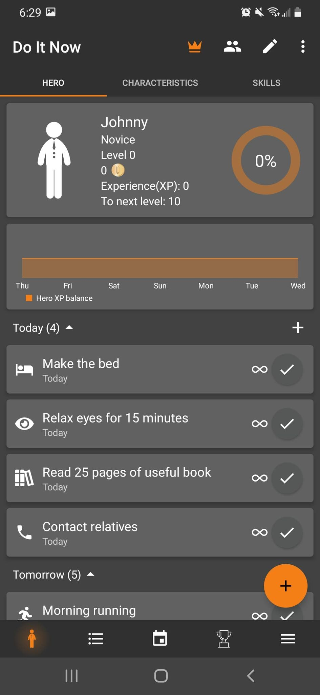

# My experience with An Interesting Planner App

## Do It Now: RPG To do List
I wanted to try an app for a daily to do list so I could try and force myself to be more productive so I looked at a few apps and picked one that looked very interesting  to me. I downloaded Do It Now: RPG To do List, its a to do list but it has a fun gimmick of giving you a "character" that earns experience from each task you complete and can level up so you can see yourself making progress. As a video game and RPG (role playing game) enjoyer I thought I would give this app a chance
Upon downloading and opening the app I was greeted with this.

