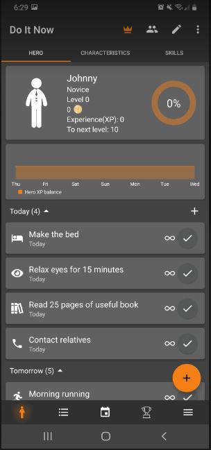
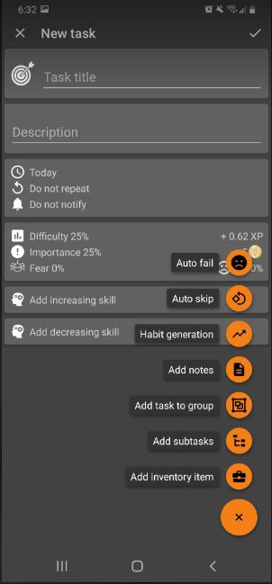
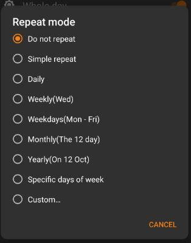

# My experience with An Interesting Planner App

## Do It Now: RPG To do List
I wanted to try an app for a daily to do list so I could try and force myself to be more productive so I looked at a few apps and picked one that looked very interesting  to me. I downloaded Do It Now: RPG To do List, its a to do list but it has a fun gimmick of giving you a "character" that earns experience from each task you complete and can level up so you can see yourself making progress. As a video game and RPG (role playing game) enjoyer I thought I would give this app a chance.
My main goals were to set up several daily tasks that I could check off to be better about being productive.
Upon downloading and opening the app I was greeted with this.

I changed my "hero's" name which is what they are called in app to my own name by tapping on the character guy
To be able to add my first task I just clicked on the big orange + on the bottom right of the screen and it brought me to a create a task page

From here I just created a few tasks for myself to complete, I added 1 hour and 2 hours worked on homework as tasks, then I changed the repeat mode to make them daily and show up daily.

