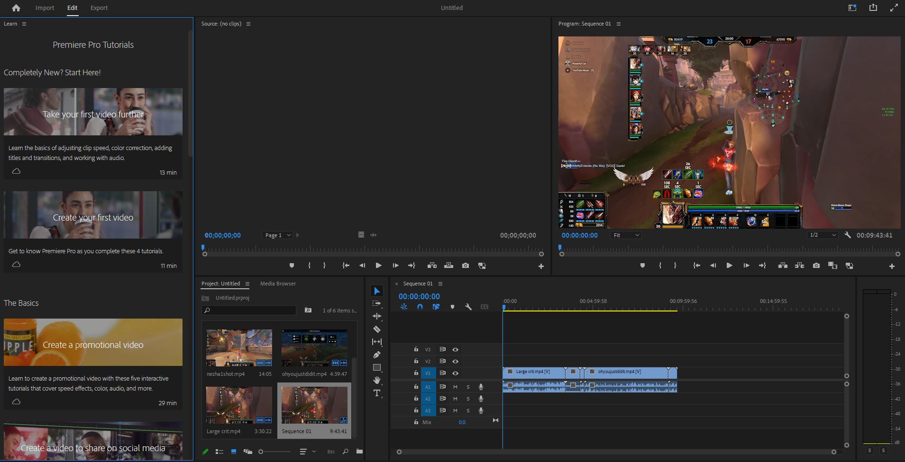
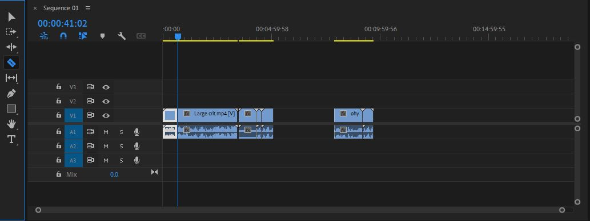
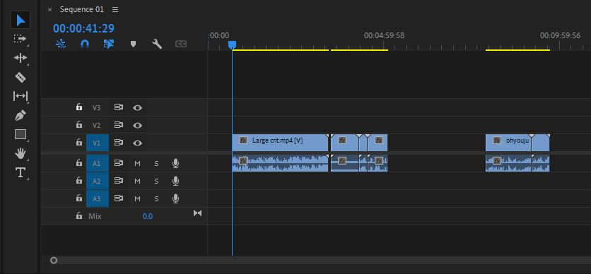
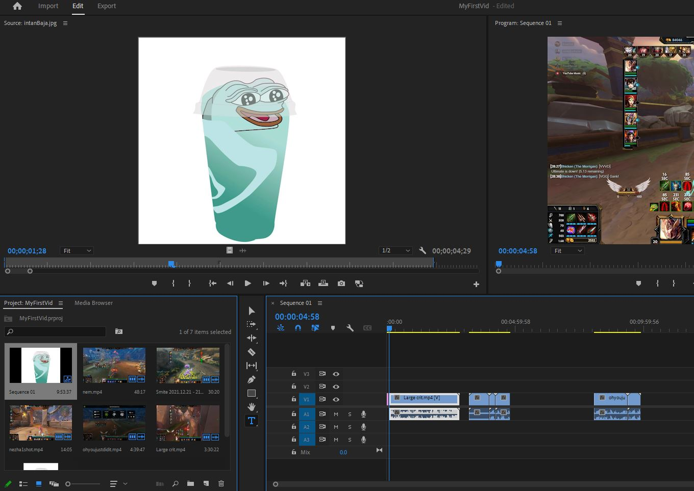
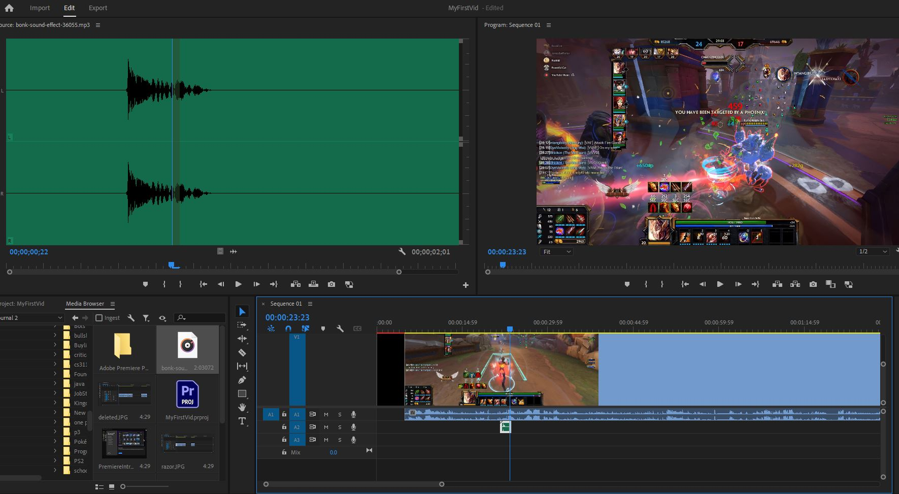
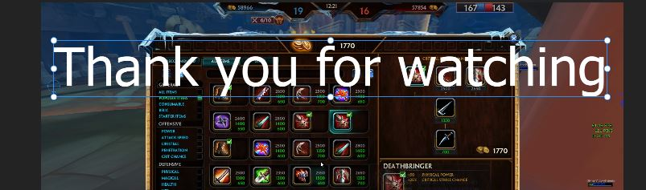

# My experience Learning Video Editing software
By: Lukas Pecson 12/7/22

## Adobe Premiere
I had always sort of wanted to get some experience with video editing, the only time I have done anything of the sort was for various school projects that required a video, however those I did a single take and threw into windows movie maker. I would like to learn Adobe Premiere while I still get it for free through CSU Chico as a student.

## My Plan going in
I just wanted to get a good grip on the features available to me, and put together a video using them. I found a bunch of old clips of video games I had recorded and so I will try to edit them together into a short fun video for myself

## Starting my first project
I downloaded adobe premiere and when I first opened it I was greeted with a page detailing the many features available

I clicked through all the features and was presented with a prompt to start my first project. I clicked the create new project button and was presented with some preset video clips to use for tutorial purposes. I saw that on the left it had all my files of my machine so I went to my clips section I had and selected a couple of clips to make a video.

Once i had the clips selected I clicked create and I was greeted by my first project with all my selected clips in the bottom left of my screen, some tutorial options on the left, and a preview+audio tracks as the main part of the screen.

My next play was to edit some of my clips. I wanted to cut out a bunch of the screentime when I was not doing anything interesting in the footage, So I went to the sidebar thats next to the video segments on the bottom of the screen and clicked on the Razor because to me that was the thing that seemed closest to a cut tool. When I clicked on the middle of the footage it then split the video into 2 different pieces. I was then able to select the just the first bit that I wanted to cut out.

Then I wanted that to delete the first chunk I selected. So my first thought was to select it and click the delete button on my keyboard and it worked exactly as I hoped it would function. I had now successfully selected and edited out some of the footage.

I then continued to cut out other bits I did not want in my video until I decided that I wanted to make a title screen for the start of my video. I clicked on the import in the top left hand side of the screen and this time I went into my photos folder and selected a random picture that I could use for the titlescreen still of my video. I imported the photo and it showed up in the bottom left of my screen and on the left upper screen but not in the actual video when I clicked play. I then right clicked on the photo and saw there was an option "Insert" which I clicked and it was added to my video. I then dragged the rest of the footage to line up and play after.

Next up I wanted to add some sound effects to my video. I went online and found some free sound effects and downloaded some to use. I ended up using this "BONK" sound effect. I navigated through the bottom left screen to where I had saved the sound and dragged it below the video file in the bottom right. From there it was just a matter of finding where exactly in the video I wanted it to be. I just clicked and dragged it and it worked exactly how I thought it would.

Finally, I wanted to just add some text on the screen at the end as a video over screen. I clicked the T button on the bar in the bottom left and then clicked on the screen. It gave me an option to write so I just typed thanks for watching. I then changed to the select tool and I clicked the text box to resize it and then I was done.

## Thoughts on Premiere
I think that from a baseline just using the software to put videos and audio together premiere works great and I didn't have to watch any tutorials to accomplish my goals that I had going in. Obviously there are much more features for advanced video editing that I did not make use of, but I was still able to do what I wanted so that is definitely a good sign. One thing I would like added is that when you mouse over an icon it would be really great if the name of the tool popped up beside it for easier learning.

When you first start up the software it offers many tutorials on how to use it, so I had the impression going in that it would be very difficult and not very learnable, but I didnt find that to be the case at all. Overall I had a really good experience using premiere and will probably go watch some of the tutorials to get more familiar with the features but for the sake of this assignment I wanted to make sure I didnt use a tutorial because I wanted it to me going in blind.
