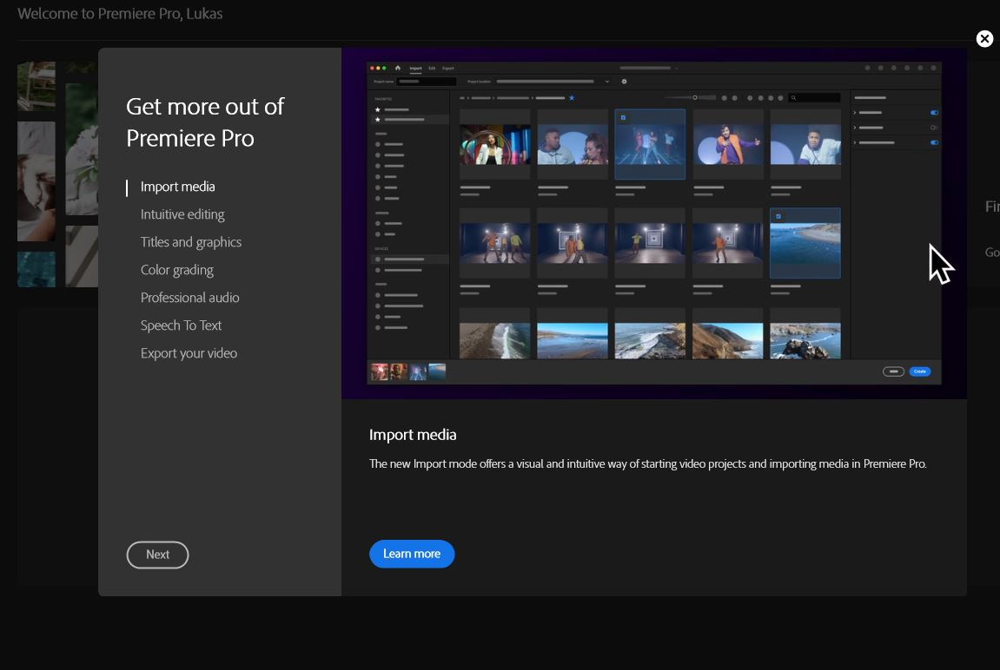
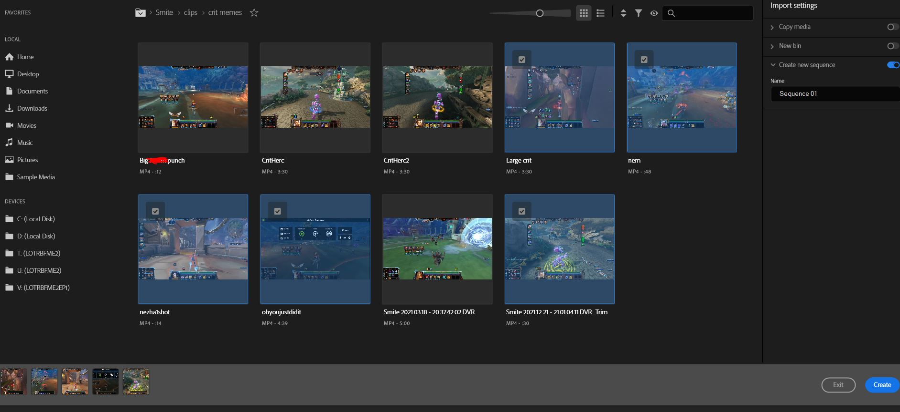

# My experience Learning Video Editing software
By: Lukas Pecson 12/7/22

## Adobe Premiere
I had always sort of wanted to get some experience with video editing, the only time I have done anything of the sort was for various school projects that required a video, however those I did a single take and threw into windows movie maker. I would like to learn Adobe Premiere while I still get it for free through CSU Chico as a student.

## My Plan going in
I just wanted to get a good grip on the features available to me, and put together a video using them. I found a bunch of old clips of video games I had recorded and so I will try to edit them together into a short fun video for myself

## Starting my first project
I downloaded adobe premiere and when I first opened it I was greeted with a page detailing the many features available

I clicked through all the features and was presented with a prompt to start my first project. I clicked the create new project button and was presented with some preset video clips to use for tutorial purposes. I saw that on the left it had all my files of my machine so I went to my clips section I had and selected a couple of clips to make a video.

